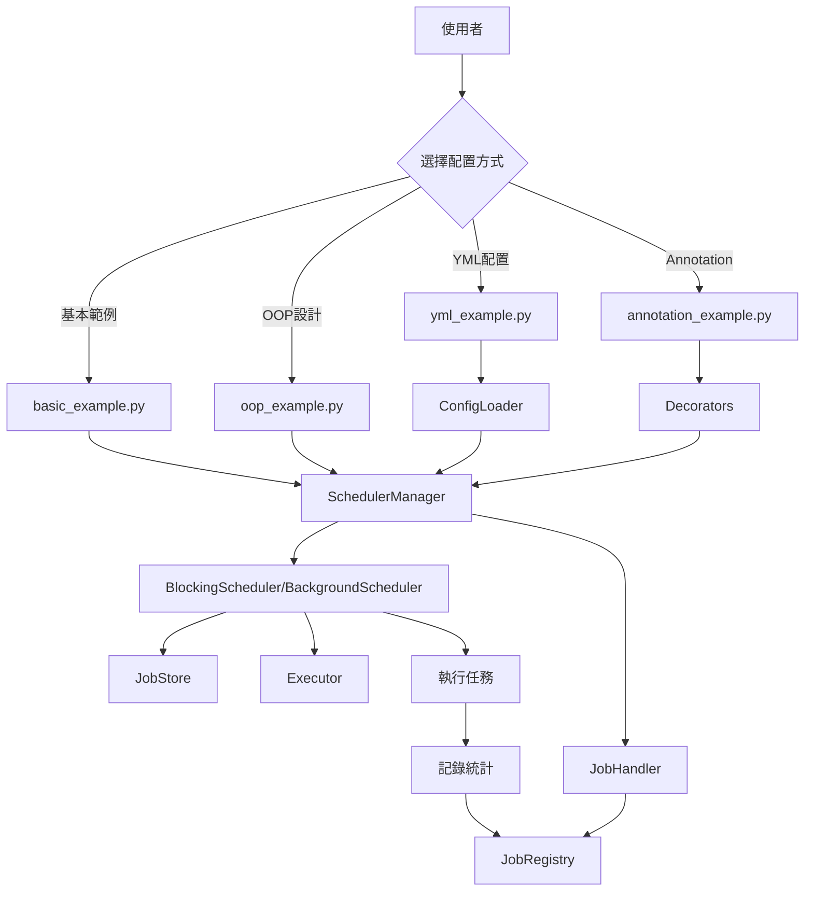
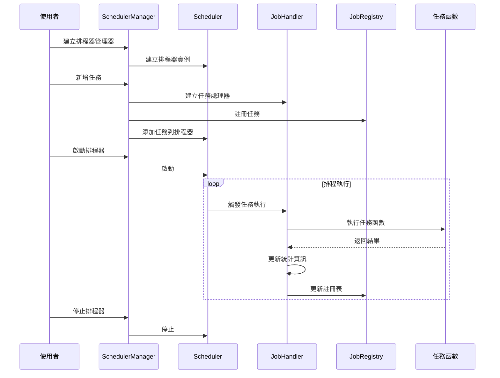
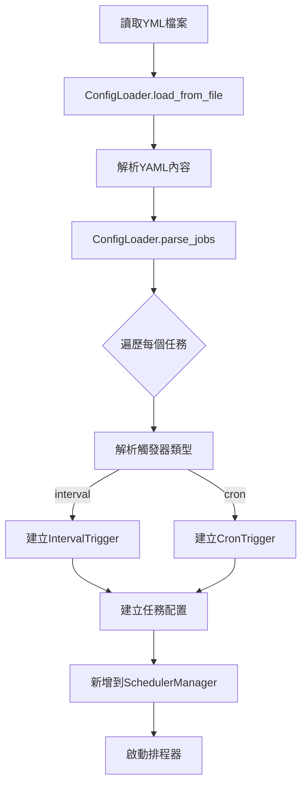
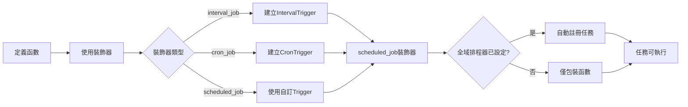
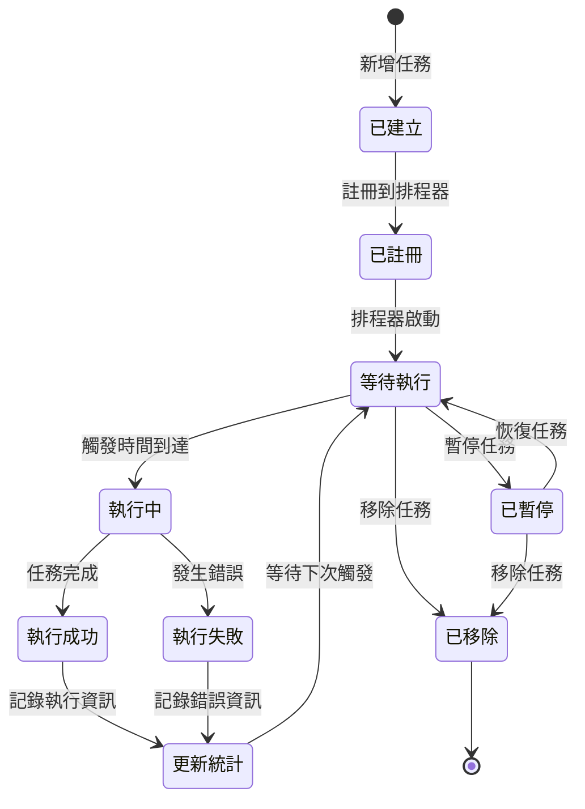
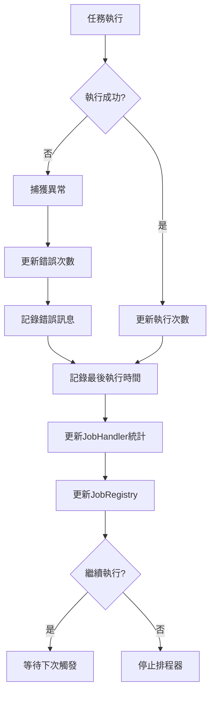
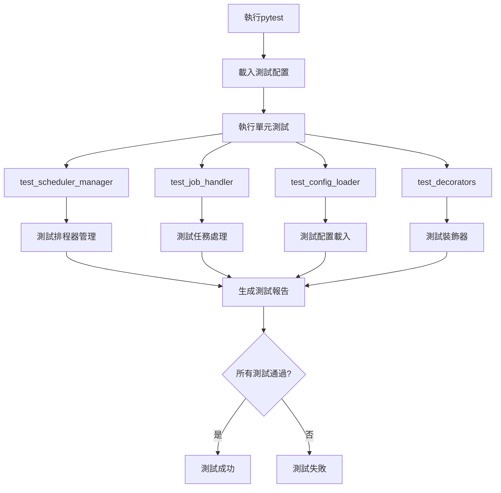

# APSchedule 流程圖說明

## 系統架構流程圖

## 任務執行流程圖

## YML 配置載入流程圖

## Annotation 裝飾器流程圖

說明：展示如何使用裝飾器定義排程任務，支援三種裝飾器類型（@interval_job、@cron_job、@scheduled_job），並自動註冊到全域排程器。

## 任務生命週期流程圖

## 錯誤處理流程圖

## 測試流程圖

